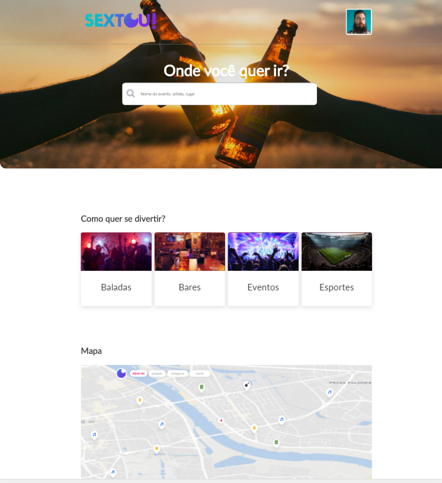
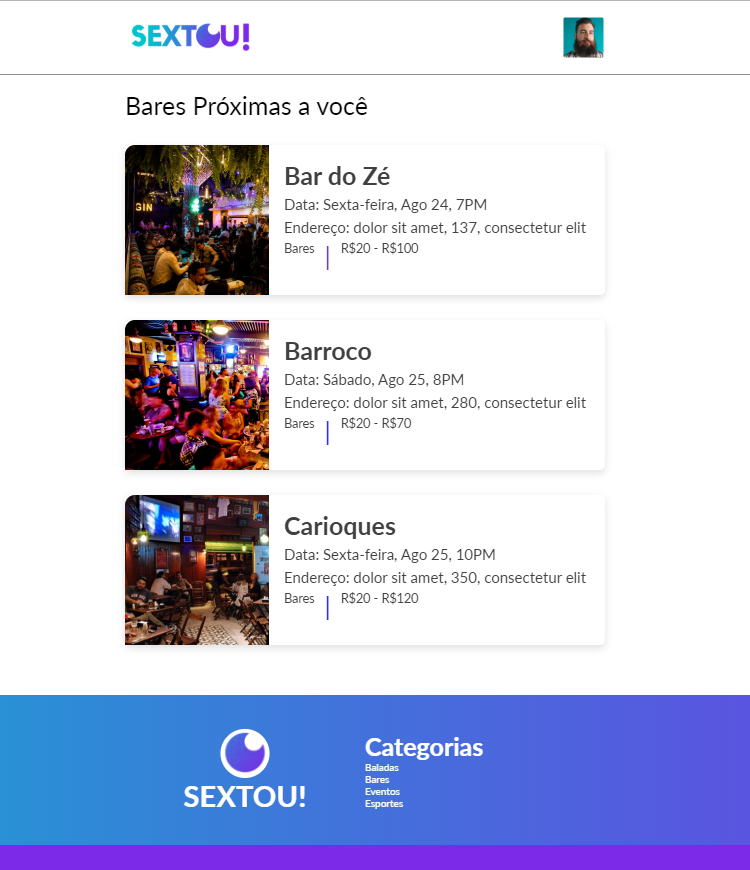
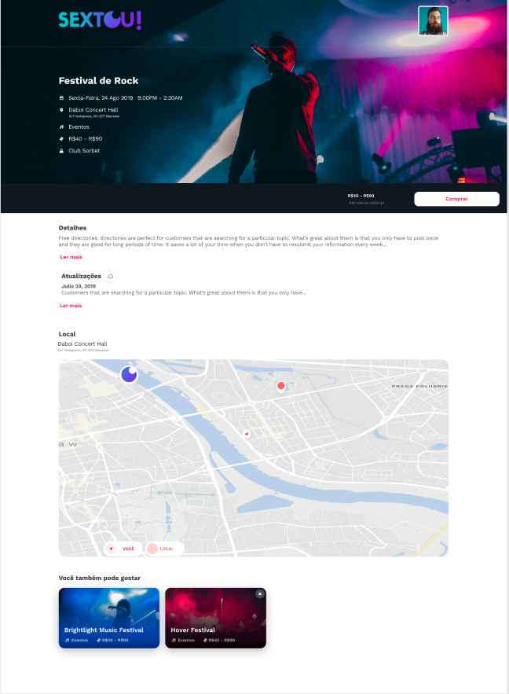

# Sextou V1 🌒

link: http://sextou.surge.sh/

## Imagens: 📷

### <strong>Página inicial:</strong>

### <strong>Página da categoria bares:</strong>

### <strong>Página de um evento:</strong>

## Sobre o projeto: 📃

Este site era uma tarefa do curso Recode Pro, e o objetivo era desenvolver um site onde você pode encontrar lugares para se divertir que estejam próximos a você, o site deveria ser construído com html, css e javascript, sem a utilização de nenhuma biblioteca.

## Requisitos do projeto: ✅

- Vou adicionar as páginas do projeto aqui.

## Frameworks e Tecnologias Utilizadas: 🌌

### Front-End: 🎨

- <strong>HTML</strong> (Criação da Interface)
- <strong>CSS</strong> (Estilização)
- <strong>Javascript / Vanilla</strong> (Criação de elementos)
